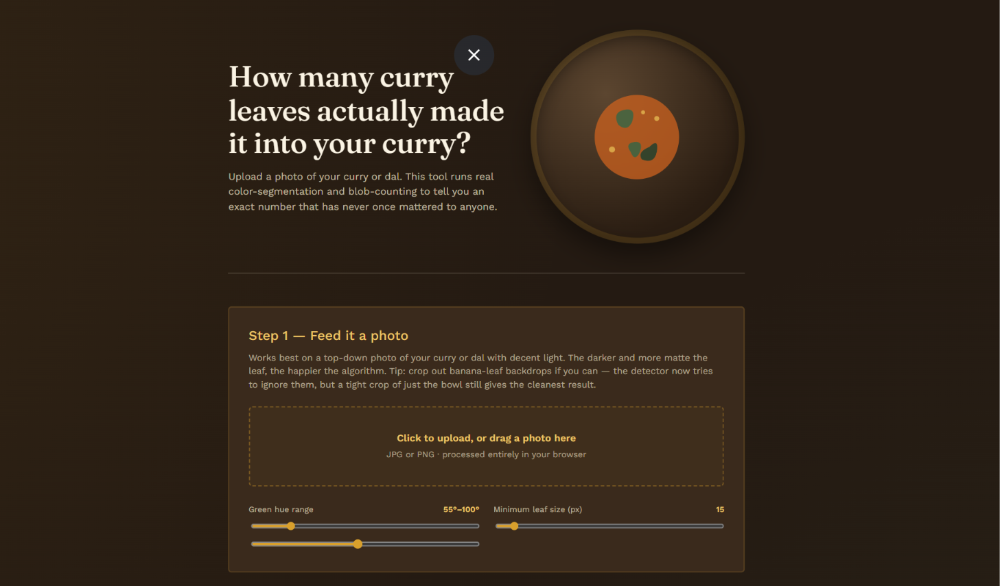
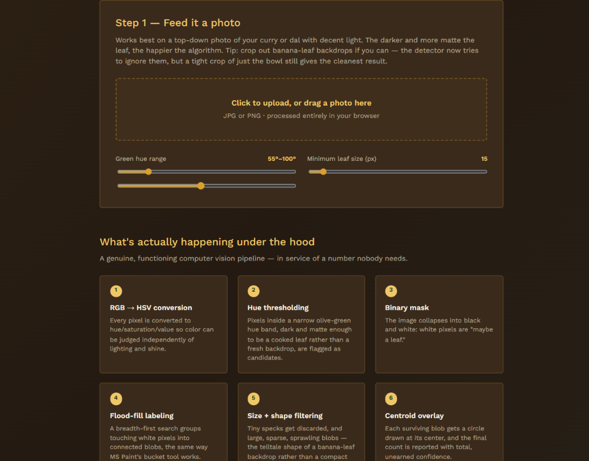
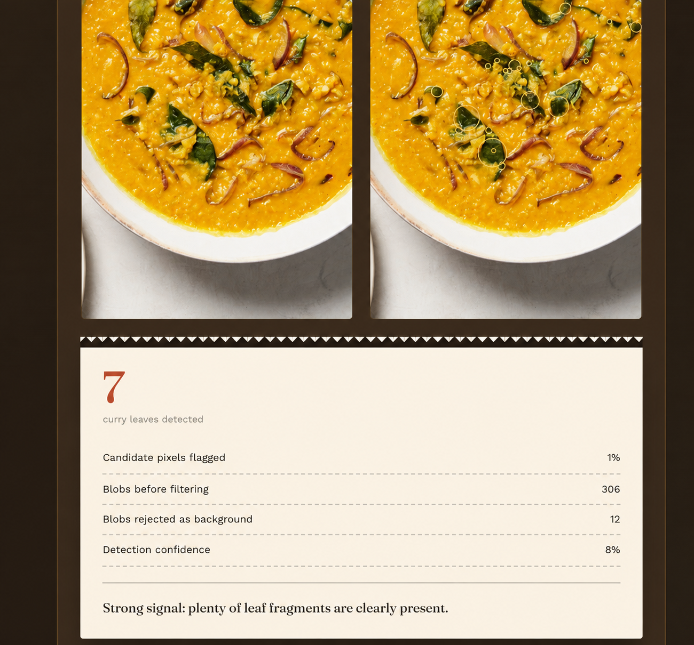

# Curry Leaf Detector 🌿🎯

## Basic Details

### Team Name: Tech Titans

### Team Members
- Team Lead: Arunima S - CAPE College of Engineering, Alappuzha
- Member 2: Benitta Ben - CAPE College of Engineering, Alappuzha

## Project Description

Curry Leaf Detector is a fun computer vision-based web application that detects and counts curry leaves from a food image. Users can upload an image, and the application identifies possible curry leaf regions and displays the detected count.

## The Problem (that doesn't exist)

Have you ever looked at your curry and wondered:

**"Exactly how many curry leaves actually made it into this curry?"** 🌿😂

Nobody really needs to know the exact number, but now you can!

## The Solution (that nobody asked for)

Curry Leaf Detector uses image processing techniques to find curry leaves in a food image. It analyzes the image, identifies green regions, filters unwanted areas, and counts the detected leaf-shaped regions.

Because apparently, counting curry leaves manually was too much work. 🌿😌

## Technical Details

### Technologies/Components Used

For Software:
- HTML
- CSS
- JavaScript
- HSV color conversion
- Hue thresholding
- Binary image masking
- Flood-fill / connected-component labeling
- Blob size and shape filtering
- Centroid detection

### Tools Used
- Visual Studio Code
- Web Browser
- GitHub

## Implementation

### Run

Open `index1.html` in a web browser.

Upload a JPG or PNG image of curry or dal and adjust the detection settings if required.

The application processes the image directly in the browser and displays the detected curry leaves.

## Project Documentation

### Screenshots

*Main interface of the Curry Leaf Detector showing the image upload section and detection settings.*

*Image processing section showing the computer vision pipeline used for detecting curry leaves.*

*Detection result showing the identified curry leaves with circles and the final detected count.*

## Project Demo

The application allows users to upload a food image, process it using color-based image segmentation and blob detection, and display the estimated number of curry leaves detected.

---
## Team Contributions

- **Arunima S (Team Lead):** Developed the website, implemented the curry leaf detection logic, handled image processing, testing, and GitHub documentation.

- **Benitta Ben:** Assisted with project ideas, testing the application, checking the detection results, and preparing project documentation.

Made with ❤️ at TinkerHub Useless Projects

